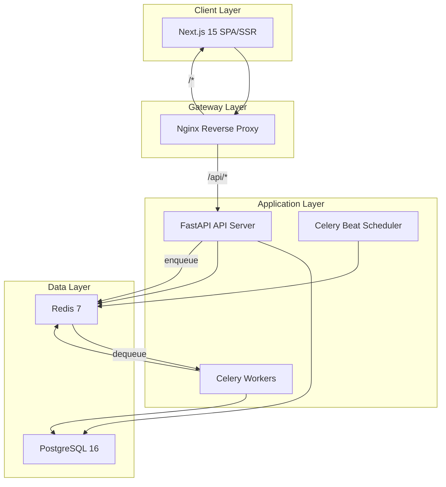
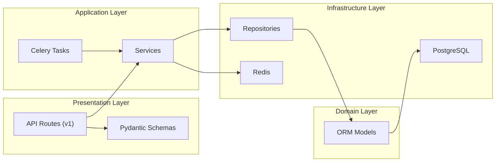
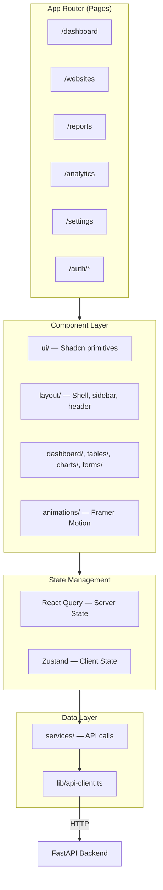
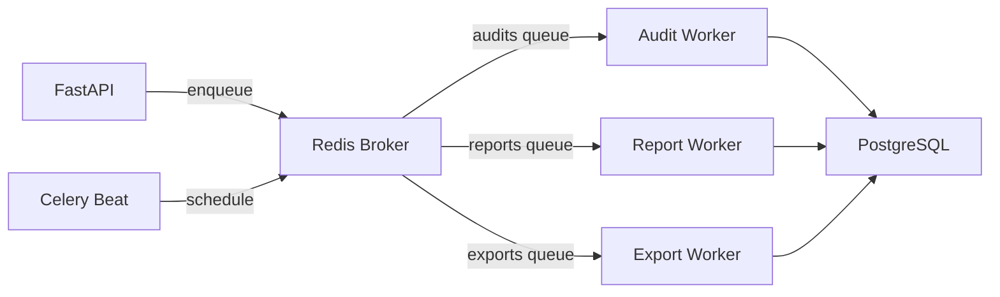

# Lead Audit Pro — System Architecture

## 1. Overview

Lead Audit Pro is a multi-tenant SaaS platform for cold-calling and lead generation. Users submit website URLs, the system runs automated audits (SEO, performance, technical), stores results, generates reports, and surfaces outreach opportunities.

This document defines the production architecture established in **Phase 01**.

---

## 2. High-Level Architecture



---

## 3. Monorepo Structure

```
lead-audit-pro/
├── frontend/                 # Next.js 15 application
│   └── src/
│       ├── app/                # App Router pages
│       ├── components/         # UI, layout, domain components
│       ├── hooks/              # Custom React hooks
│       ├── lib/                # Utilities, API client, design tokens
│       ├── services/             # API service layer (React Query callers)
│       ├── store/              # Zustand client state
│       ├── styles/             # Global CSS and design tokens
│       └── types/              # TypeScript type definitions
│
├── backend/                    # FastAPI application
│   └── app/
│       ├── api/v1/             # Versioned REST endpoints
│       ├── core/               # Config, security, database, middleware
│       ├── models/             # SQLAlchemy ORM models
│       ├── schemas/            # Pydantic request/response schemas
│       ├── repositories/       # Data access layer
│       ├── services/           # Business logic layer
│       ├── workers/            # Celery tasks and configuration
│       └── utils/              # Shared helpers
│
├── docker/                     # Container definitions
│   ├── frontend/
│   ├── backend/
│   ├── nginx/
│   └── postgres/
│
├── docs/                       # Architecture documentation
├── docker-compose.yml          # Development environment
├── docker-compose.prod.yml     # Production environment
└── .env.example                # Environment variable template
```

---

## 4. Backend Architecture (Clean Architecture)



### Layer Responsibilities

| Layer | Location | Responsibility |
|-------|----------|----------------|
| **Presentation** | `api/v1/`, `schemas/` | HTTP handling, input validation, response serialization |
| **Application** | `services/`, `workers/` | Business rules, orchestration, background jobs |
| **Domain** | `models/` | Entity definitions, relationships, constraints |
| **Infrastructure** | `repositories/`, `core/` | Database access, caching, external integrations |

### Dependency Rule

Dependencies flow inward only: `API → Service → Repository → Model`. Repositories never import services. Models never import repositories.

---

## 5. Frontend Architecture



### State Management Separation

| State Type | Tool | Store / Pattern | Examples |
|------------|------|-----------------|----------|
| **Server State** | React Query | Query keys per resource | Websites list, audit results, analytics |
| **Authentication** | Zustand (persisted) | `auth-store.ts` | User, JWT tokens, login state |
| **Dashboard UI** | Zustand | `dashboard-store.ts` | Sidebar collapse, filters, date range |
| **Global UI** | Zustand | `ui-store.ts` | Theme, modals, mobile menu |

---

## 6. Routing Architecture

### Frontend Routes (Next.js App Router)

| Route | Purpose | Layout |
|-------|---------|--------|
| `/` | Redirect to dashboard | Root |
| `/dashboard` | Overview stats and quick actions | DashboardShell |
| `/websites` | Website CRUD and bulk import | DashboardShell |
| `/reports` | Generated report management | DashboardShell |
| `/analytics` | Trends, scores, issue analysis | DashboardShell |
| `/settings` | Profile, team, preferences | DashboardShell |
| `/auth/login` | Authentication | Auth (standalone) |
| `/auth/register` | Registration | Auth (standalone) |

### Backend API Routes (v1)

All routes prefixed with `/api/v1`. See [API.md](API.md) for full endpoint reference.

---

## 7. Security Architecture

```mermaid
flowchart LR
    Request["Incoming Request"] --> Nginx["Nginx Rate Limit"]
    Nginx --> CORS["CORS Middleware"]
    CORS --> Headers["Security Headers"]
    Headers --> RateLimit["SlowAPI Rate Limit"]
    RateLimit --> JWT["JWT Validation"]
    JWT --> RBAC["RBAC Check"]
    RBAC --> Validation["Pydantic Validation"]
    Validation --> ORM["SQLAlchemy ORM"]
    ORM --> DB["PostgreSQL"]
```



| Control | Implementation |
|---------|----------------|
| **Authentication** | JWT access tokens (30 min) + refresh tokens (7 days) |
| **Authorization** | Role hierarchy: super_admin > admin > manager > analyst > viewer |
| **Rate Limiting** | SlowAPI (API), Nginx `limit_req` (gateway) |
| **Input Validation** | Pydantic schemas on all endpoints |
| **SQL Injection** | SQLAlchemy parameterized queries exclusively |
| **CSRF** | SameSite cookies + CSRF secret (Phase 02) |
| **Secure Headers** | X-Frame-Options, X-Content-Type-Options, Referrer-Policy |
| **Password Hashing** | bcrypt via passlib |

---

## 8. Queue Architecture



| Queue | Task | Concurrency |
|-------|------|-------------|
| `audits` | `run_audit` | 4–8 workers |
| `reports` | `generate_report` | 2–4 workers |
| `exports` | `run_export` | 2 workers |

Scheduled tasks: `cleanup_expired_reports` (daily), `retry_failed_audits` (hourly).

---

## 9. Scalability Design

| Requirement | Strategy |
|-------------|----------|
| 10,000+ websites | Indexed `owner_id`, `domain`, `status`; pagination on all list endpoints |
| 100,000+ audit records | Composite indexes on `(website_id, status)`, `created_at`; archival policy |
| Background processing | Celery with dedicated queues per task type |
| Future AI integrations | Service layer abstraction in `services/`; pluggable audit pipeline |
| Future CRM integrations | Webhook/event system (Phase 05); export API |
| Future email outreach | Separate `outreach` module (Phase 06) |

---

## 10. Technology Versions

| Component | Version | Notes |
|-----------|---------|-------|
| Next.js | 15.1.x | App Router, standalone output |
| React | 19.0.x | |
| TypeScript | 5.7.x | Strict mode |
| Tailwind CSS | 3.4.x | |
| FastAPI | 0.115.x | |
| Python | 3.12 | |
| PostgreSQL | 16 | uuid-ossp, pg_trgm extensions |
| Redis | 7 | AOF persistence in production |
| Celery | 5.4.x | JSON serialization |
| Node.js | 20 LTS | Docker base image |

---

## 11. Related Documents

- [DATABASE.md](DATABASE.md) — Entity relationships and indexing
- [API.md](API.md) — REST endpoint reference
- [DEPLOYMENT.md](DEPLOYMENT.md) — Production deployment guides
- [ROADMAP.md](ROADMAP.md) — Development phases
