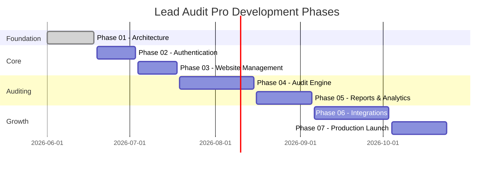

# Lead Audit Pro — Development Roadmap

## Phase Overview

---

## Phase 01 — Project Foundation & Architecture ✅

**Status:** Complete  
**Duration:** June 2026

### Deliverables

- [x] Complete monorepo folder structure
- [x] Frontend architecture (Next.js 15, design system, state management)
- [x] Backend architecture (FastAPI, clean architecture layers)
- [x] Database models and ERD documentation
- [x] API route scaffolding with endpoint planning
- [x] Docker development and production environments
- [x] Environment variable configuration
- [x] Coding standards (ESLint, Ruff, Prettier, EditorConfig)
- [x] Architecture documentation suite

---

## Phase 02 — Authentication & User Management ✅

**Status:** Complete  
**Duration:** June 2026

### Backend Tasks

- [x] Implement user registration with email validation
- [x] Implement JWT login with access + refresh token rotation
- [x] Implement token refresh and logout (token blacklist in Redis)
- [x] Implement `/auth/me` endpoint
- [x] Implement user CRUD with RBAC enforcement
- [x] Create initial Alembic migration
- [x] Seed super_admin user script
- [x] Write auth integration tests

### Frontend Tasks

- [x] Wire login/register forms to API
- [x] Implement auth middleware (protected routes)
- [x] Token refresh interceptor in API client
- [x] User profile page in settings
- [ ] Role-based UI element visibility (Phase 03)

### Acceptance Criteria

- Users can register, login, and access protected dashboard
- Tokens refresh automatically before expiry
- RBAC prevents unauthorized API access

---

## Phase 03 — Website Management ✅

**Status:** Complete  
**Duration:** June 2026

### Backend Tasks

- [x] Implement website CRUD endpoints
- [x] URL validation and domain extraction
- [x] Bulk import with deduplication
- [x] Pagination, filtering, and search
- [x] Website status lifecycle management

### Frontend Tasks

- [x] Website data table with sorting and filtering
- [x] Add/edit website modal forms
- [x] Bulk CSV import UI
- [ ] Website detail view (Phase 04 — audit results)
- [x] React Query hooks for website data

### Acceptance Criteria

- Users can manage 100+ websites with search and filters
- Bulk import handles 500 URLs per request
- Duplicate domains are detected per user

---

## Phase 04 — Audit Engine ✅

**Status:** Complete  
**Duration:** June 2026

### Backend Tasks

- [x] Implement SEO analysis service (title, meta, headings, links)
- [x] Implement performance analysis service (Core Web Vitals)
- [x] Implement technical analysis service (SSL, headers, DNS)
- [x] Audit orchestration service (coordinate sub-services)
- [x] Celery `run_audit` task implementation
- [x] Audit status polling endpoint
- [x] Retry logic for failed audits
- [x] Score calculation algorithm

### Frontend Tasks

- [x] Trigger audit from website list/detail
- [ ] Bulk audit action
- [x] Real-time audit status polling
- [ ] Audit results detail view (SEO, perf, technical tabs)
- [x] Score visualization components (dashboard/analytics)

### Acceptance Criteria

- Audits complete within 60 seconds for standard websites
- Celery processes 4+ concurrent audits
- Failed audits retry up to 3 times
- Sub-reports populate with structured data

---

## Phases 05–12

Full documentation: [`docs/PHASES_05_12.md`](PHASES_05_12.md) and [`docs/ROADMAP_PHASES_04_12.md`](ROADMAP_PHASES_04_12.md)

| Phase | Name | Status |
|-------|------|--------|
| 05 | SEO Audit Engine | ✅ Complete |
| 06 | Performance Audit Engine | ✅ Complete |
| 07 | Technical Audit Engine | ✅ Complete |
| 08 | AI Report Generator | ✅ Complete |
| 09 | PDF Report System | ✅ Complete |
| 10 | Dashboard & Analytics | ✅ Complete |
| 11 | Export & Lead Management | ✅ Complete |
| 12 | Production Deployment | ✅ Complete |

---

## Phase 05 — Reports & Analytics (Legacy Roadmap Entry)

> Superseded by Phases 05–12 above. See `docs/PHASES_05_12.md`.

---

## Phase 06 — Integrations & Advanced Features

**Duration:** ~4 weeks

### Planned Integrations

- [ ] AI-powered audit insights (OpenAI/Anthropic API)
- [ ] CRM webhook connectors (HubSpot, Salesforce)
- [ ] Email outreach templates (SendGrid/Resend)
- [ ] Webhook event system for third-party consumers
- [ ] API key management for external access

### Advanced Features

- [ ] Team/organization multi-tenancy
- [ ] Audit scheduling (recurring audits)
- [ ] Custom audit templates
- [ ] Notification system (email + in-app)

---

## Phase 07 — Production Launch

**Duration:** ~3 weeks

### Tasks

- [ ] Security audit and penetration testing
- [ ] Load testing (10K websites, 100K audits)
- [ ] Production deployment on chosen provider
- [ ] SSL/TLS configuration
- [ ] Monitoring and alerting setup (Sentry, uptime)
- [ ] Backup and disaster recovery verification
- [ ] Documentation finalization
- [ ] Onboarding flow and help center

### Launch Checklist

- [ ] All environment secrets rotated for production
- [ ] `APP_DEBUG=false` confirmed
- [ ] Rate limiting verified under load
- [ ] Database backups automated and tested
- [ ] Error tracking active
- [ ] Domain and SSL configured
- [ ] Smoke tests passing on production

---

## Technical Debt Tracker

| Item | Priority | Phase |
|------|----------|-------|
| Alembic initial migration | High | 02 |
| Auth token blacklist (Redis) | High | 02 |
| API integration tests | Medium | 03 |
| E2E tests (Playwright) | Medium | 04 |
| Structured logging (structlog) | Low | 05 |
| OpenAPI client generation | Low | 05 |
| CI/CD pipeline (GitHub Actions) | High | 07 |

---

## Success Metrics

| Metric | Target |
|--------|--------|
| Audit completion time | < 60 seconds |
| API response time (p95) | < 200ms |
| Dashboard load time | < 2 seconds |
| Uptime | 99.9% |
| Concurrent audits | 8+ |
| Websites per account | 10,000+ |
| Audit records | 100,000+ |
